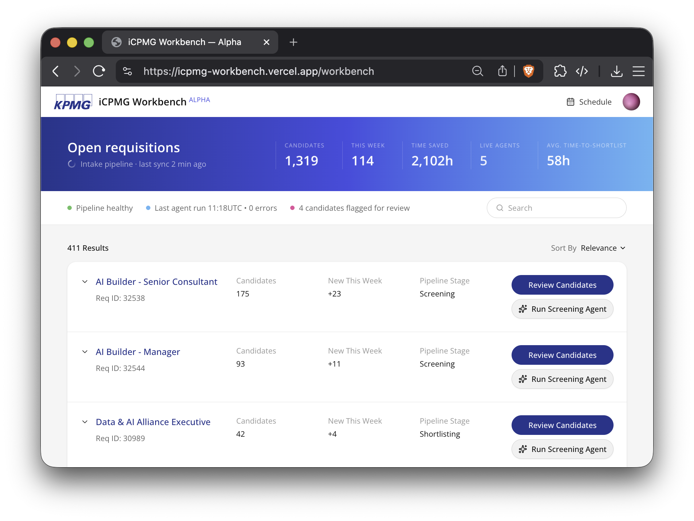

# icpmg-workbench

Prototype team workbench for evaluating candidates at scale. Demo uses synthetic/sample candidate data.



Data pipeline and mapping details: [DATA.md](./DATA.md).


## Origin: Personal Hiring & Screening Experience

This prototype stems from my own applicant screening experience. During my last employment, I took the initiative to help hire developers end to end, all on my own. Not too long after, I was creating roles, posting job listings, screening candidates, scheduling interviews, meeting applicants - managing the whole pipeline. 

What I learned here was - screening's no joke. And it's a nightmare when candidate volume is high - especially when some roles and one click apply processes attract hundreds or thousands of applications...

To make the process more structured, I asked colleagues whether we could avoid relying only on `simple apply` button flows & have candidates apply through a consistent intake flow. 

So we tried it. 

We used a Google Form. Applicants submitted info, I parsed the details in Sheets, did some cleanup - compared signals, built filters, and used practical spreadsheet tactics to move from raw applicant volume (>1k) to a reviewable shortlist.

The team learned that having a clear pipeline to iterate on - this was a good thing. More consistent candidate review, stronger handoff into interviews - this planted the seed for my demo today.

## Thesis

The assignment asks candidates to build something that helps evaluate AI Builders well.

My interpretation:

> Help the hiring team evaluate AI Builder candidates by turning high-volume candidate intake into an inspectable, evidence-based reviewer workflow.

The goal is not to automate hiring decisions. The goal is to help reviewers see the right evidence faster, compare candidates more consistently, and preserve human judgment at the decision boundary.

## Approach

I started from my own experience screening applicants and asked what it really means to "evaluate an AI Builder" in a high-volume process.

The first instinct is to benchmark for the single best candidate. That matters, but it is not enough. In a real hiring workflow, the team also needs to review more candidates without losing consistency, context, or fairness.

The product tension became:

> Do we optimize for finding the best candidate, or do we optimize for increasing the number of candidates the team can review well?

The answer should be both.

The workbench is scoped around that balance:

* help the hiring team identify strong matches quickly
* keep evidence visible instead of hiding everything behind a score
* show missing critical signals and risk flags
* support cross-role recommendations when someone may fit another opening better
* reduce manual spreadsheet-style filtering
* preserve human accountability for shortlist, interview, and hiring decisions

This is why the demo is not framed as an automated ranking engine. It is a reviewer workbench: a way to make candidate volume more manageable while still letting humans inspect the evidence behind each recommendation.

## What This Demo Is

`icpmg-workbench` is a Next.js prototype that models a candidate intelligence layer around an iCIMS-style hiring workflow.

The demo is designed as if the hiring team is reviewing 300+ synthetic applicants across multiple roles, including:

* AI Builder - Senior Consultant
* AI Builder - Manager
* Data & AI Alliance Executive

The workbench displays:

* open requisitions
* candidate volume by role
* pipeline stage
* top candidate snapshots
* recommendation bands
* cross-role recommendations
* evidence highlights
* missing critical signals
* risk flags requiring human review
* a reviewer-oriented path from volume to shortlist

## Why This Fits The Assignment

KPMG's prompt is not asking for a generic hiring tool. It asks for an artifact that helps evaluate AI Builder candidates while showing how the applicant handles ambiguity, tradeoffs, and responsible AI.

This prototype is intended to demonstrate:

* **Ambiguity to direction:** The open prompt is reframed into a concrete hiring-team workflow.
* **Builder mindset:** The artifact is a working app, not just a slide or rubric.
* **Practicality:** The workflow targets a real pain point: screening high-volume candidate pools.
* **Usability:** The reviewer can inspect roles, candidate groupings, scores, highlights, and risk flags.
* **Enterprise judgment:** The system supports review and triage without making final hiring decisions.
* **Responsible AI:** The demo uses synthetic/sample data and keeps humans accountable for assessment outcomes.

## Intended Workflow

```text
candidate applications
-> structured candidate data
-> evidence extraction and normalization
-> role-specific review bands
-> risk and missing-signal flags
-> reviewer shortlist workflow
-> human interview and hiring decisions
```

The AI-assisted layer should help organize and explain evidence. It should not decide who gets hired.

## Tech Stack

* Next.js
* React
* TypeScript
* Tailwind CSS
* Framer Motion
* Bun
* Biome

## Setup

```bash
bun i
bun run dev
```

Open:

```text
http://localhost:3000
```

## Commands

```bash
bun run types
bun run lint:check
bun run format:check
bun run all:check
bun run build
```
